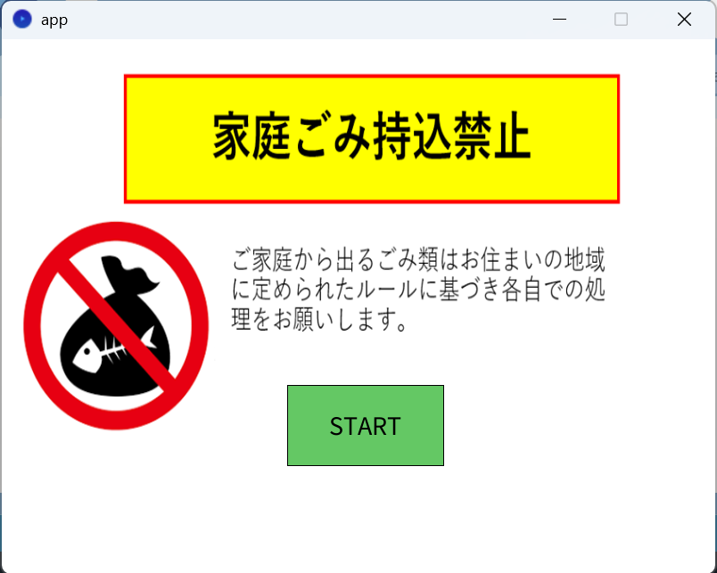
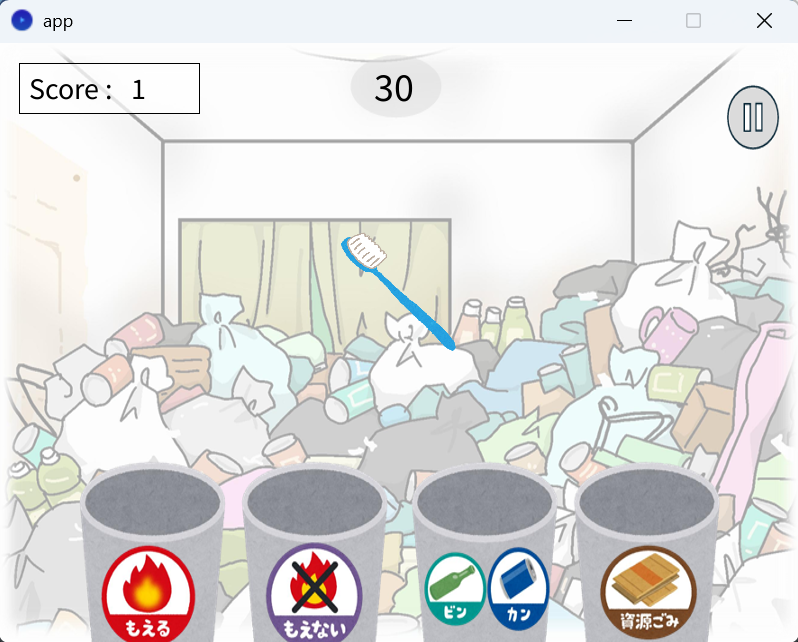
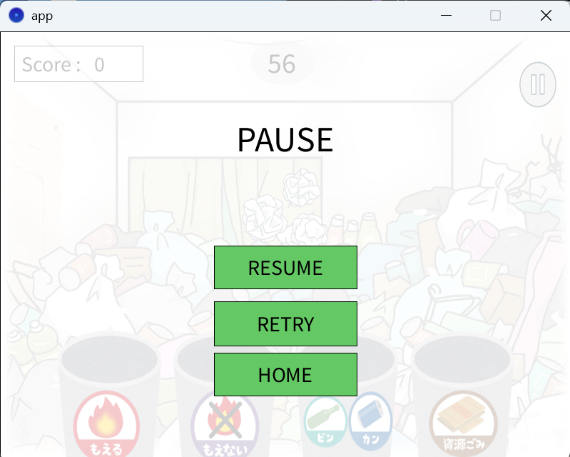
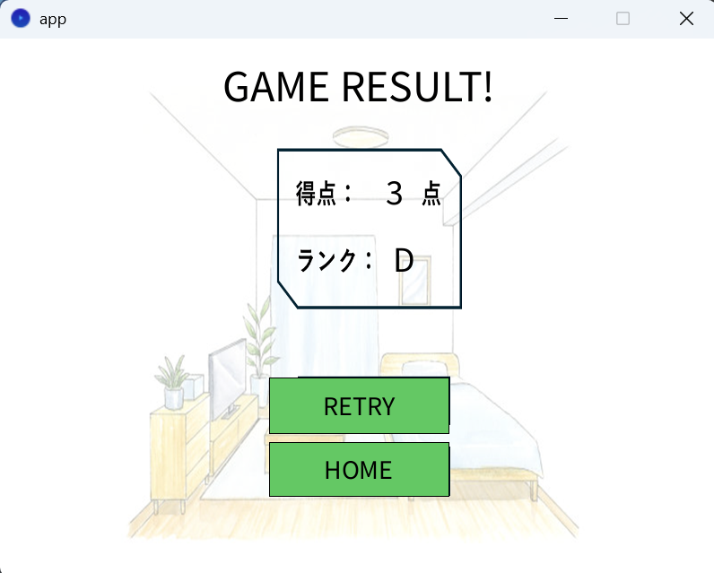

# エコチャレンジ！ゴミ分別マスター

## 取扱説明書

### 1. ゲーム概要

「エコチャレンジ！ゴミ分別マスター」は、表示されるゴミを正しいゴミ箱へドラッグ＆ドロップして分別するゲームです。

制限時間内にできるだけ多く正しく分別し、高得点を目指しましょう。

---

## 2. 動作環境

- Processing 4.x

---

## 3. 起動方法

1. Processingでプロジェクトを開きます。
2. `app.pde` を開きます。
3. Processingの実行ボタン（▶）を押します。
4. タイトル画面が表示されます。

---

## 4. ゲームの始め方

タイトル画面で **START** ボタンをクリックするとゲームが始まります。

---

## 5. 操作方法

ゲームではマウスのみを使用します。

| 操作         | 内容               |
| ------------ | ------------------ |
| 左クリック   | ゴミを選択します。 |
| ドラッグ     | ゴミを移動します。 |
| マウスを離す | ゴミ箱へ入れます。 |

ゴミを正しいゴミ箱へドラッグ＆ドロップして分別してください。

---

## 6. ゴミ箱の種類

ゲームには4種類のゴミ箱があります。

| ゴミ箱       | 例                   |
| ------------ | -------------------- |
| 燃えるごみ   | 生ごみ、ティッシュ   |
| 燃えないごみ | フライパン、乾電池   |
| 資源ごみ     | 空き缶、ガラスびん   |
| リサイクル   | 新聞紙、ペットボトル |

ゴミの種類に応じて正しいゴミ箱へ入れてください。

---

## 7. 得点について

- 正しく分別すると **+1点**
- 間違ったゴミ箱へ入れると **-1点**

制限時間終了時の得点が最終スコアとなります。

---

## 8. ゲームの流れ

1. タイトル画面で **START** を押します。
2. 制限時間60秒でゲームが始まります。
3. 表示されるゴミを正しいゴミ箱へドラッグ＆ドロップします。
4. 制限時間終了後、結果画面が表示されます。
5. **RETRY** ボタンを押すともう一度プレイできます。

---

## 9. 画面説明

### タイトル画面

ゲーム開始前の画面です。

STARTボタンを押すことでゲームが始まります。

---

### ゲーム画面

ゲーム画面では以下の情報が表示されます。

- 制限時間
- 現在の得点
- ゴミ
- ゴミ箱
- ポーズボタン（右上）

表示されたゴミを正しいゴミ箱へドラッグして分別してください。

---

### ポーズ画面

ゲームを一時停止できる画面です。

- RESUME：ゲームを再開
- RETRY：ゲームを最初からやり直す
- HOME：タイトル画面へ戻る

---

### 結果画面

ゲーム終了後、最終得点が表示されます。

RETRYボタンを押すと再度ゲームをプレイできます。
---

## 10. 注意事項

- ゴミはゴミ箱の上でマウスを離してください。
- 制限時間は60秒です。
- Processingの実行画面を閉じるとゲームは終了します。